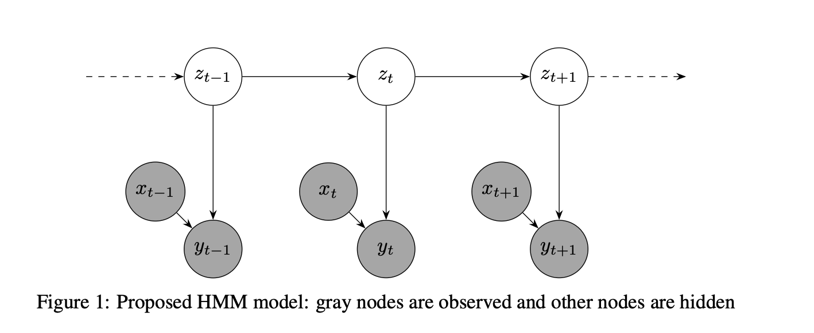

## Introduction

We replicate the paper by Ashwood et al. [ashwood2022mice] In perceptual decision-making, agents such as rodents and humans process sensory information to guide their choices. Traditional computational models, like signal detection theory [steckler2001using] and evidence accumulation frameworks [odoemene2018visual], have typically assumed that individuals apply a consistent decision-making strategy throughout an entire experiment. Recently, reinforcement learning (RL) models [luksys2009stress, bathellier2013multiplicative] have challenged this notion by proposing that agents dynamically adapt their strategies to optimize performance over time.

Despite these advances, current models still struggle to account for unexpected errors that agents commit even in seemingly straightforward trials with strong perceptual cues. These errors, known as "lapses," are generally viewed as sporadic mistakes due to temporary lapses in attention or memory. Standard modeling approaches, such as epsilon-greedy RL, typically assume lapses occur randomly and independently, assigning them a fixed probability (epsilon) where agents ignore available information and make arbitrary choices.

However, lapses may not simply be random events; rather, they could reflect abrupt shifts in underlying decision-making strategies. For instance, rodents might alternate between an "engaged" state, characterized by consistently accurate performance, and a "disengaged" state, marked by increased lapses. To better capture these latent strategic shifts, we propose employing Hidden Markov Models (HMMs). Our hypothesis is that modeling decision-making using HMMs will more accurately reflect experimental behavior compared to traditional models.

This methodological innovation is significant because it provides a more nuanced understanding of the behavioral policies governing perceptual decision-making. By explicitly modeling latent states, HMMs can reveal the hidden structure underlying perceptual errors, showing that lapses reflect deeper strategic changes rather than isolated occurrences.

Identifying and segmenting these latent strategies will open promising avenues for future research, including:

- Investigating the origins and adaptive functions of various decision-making strategies.

- Exploring the neural mechanisms underlying distinct behavioral states.

- Assessing whether these strategies represent bounded rationality or fluctuations in motivation.

## Full project report: [GM_HMM.pdf](GM_HMM.pdf)
